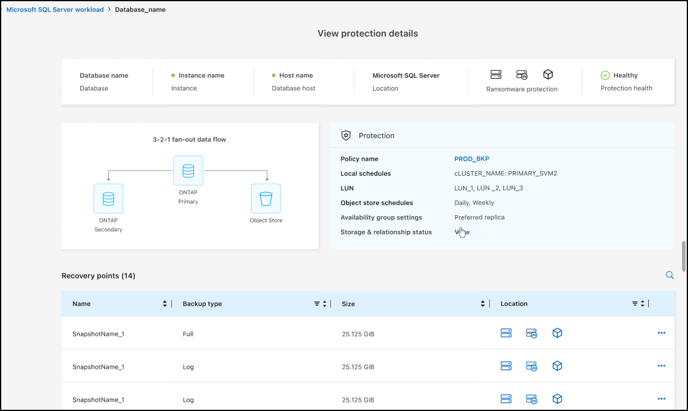

= Carico di lavoro di Microsoft SQL Server supportato in disponibilità generale (GA)
:allow-uri-read: 

=== Carico di lavoro di Microsoft SQL Server supportato in disponibilità generale (GA)

Il supporto del carico di lavoro di Microsoft SQL Server è ora generalmente disponibile (GA) in NetApp Backup and Recovery. Le organizzazioni che utilizzano un ambiente MSSQL su ONTAP, Cloud Volumes ONTAP e Amazon FSx for NetApp ONTAP possono ora sfruttare questo nuovo servizio di backup e ripristino per proteggere i propri dati.

Questa versione include i seguenti miglioramenti al supporto del carico di lavoro di Microsoft SQL Server rispetto alla versione di anteprima precedente:

* * Sincronizzazione attiva SnapMirror *: questa versione supporta ora la sincronizzazione attiva SnapMirror (nota anche come SnapMirror Business Continuity [SM-BC]), che consente ai servizi aziendali di continuare a funzionare anche in caso di guasto completo del sito, supportando il failover delle applicazioni in modo trasparente utilizzando una copia secondaria. NetApp Backup and Recovery supporta ora la protezione dei database Microsoft SQL Server in una configurazione SnapMirror ActiveSync e Metrocluster. Le informazioni vengono visualizzate nella sezione *Stato di archiviazione e relazione* della pagina Dettagli protezione. Le informazioni sulla relazione vengono visualizzate nella sezione aggiornata *Impostazioni secondarie* della pagina Policy.
+
Fare riferimento a https://docs.netapp.com/us-en/data-services-backup-recovery/br-use-policies-create.html["Utilizza policy per proteggere i tuoi carichi di lavoro"] .

+

* *Supporto multi-bucket*: ora puoi proteggere i volumi all'interno di un ambiente di lavoro con un massimo di 6 bucket per ambiente di lavoro su diversi provider cloud.
* *Aggiornamenti di licenze e versioni di prova gratuite* per carichi di lavoro di SQL Server: ora puoi utilizzare il modello di licenza NetApp Backup and Recovery esistente per proteggere i carichi di lavoro di SQL Server. Non esiste alcun requisito di licenza separato per i carichi di lavoro di SQL Server.
+
Per i dettagli, fare riferimento a https://docs.netapp.com/us-en/data-services-backup-recovery/br-start-licensing.html["Impostare la licenza per NetApp Backup and Recovery"] .

* *Nome snapshot personalizzato*: ora puoi utilizzare il nome del tuo snapshot in un criterio che regola i backup per i carichi di lavoro di Microsoft SQL Server. Inserisci queste informazioni nella sezione *Impostazioni avanzate* della pagina Policy.
+
image:../media/screen-br-sql-policy-create-advanced-snapmirror.png["Screenshot delle impostazioni del formato SnapMirror e snapshot per le policy NetApp Backup and Recovery"]

+
Fare riferimento a https://docs.netapp.com/us-en/data-services-backup-recovery/br-use-policies-create.html["Utilizza policy per proteggere i tuoi carichi di lavoro"] .

* *Prefisso e suffisso del volume secondario*: è possibile immettere un prefisso e un suffisso personalizzati nella sezione *Impostazioni avanzate* della pagina Criteri.
* *Identità e accesso*: ora puoi controllare l'accesso degli utenti alle funzionalità.
+
Fare riferimento a https://docs.netapp.com/us-en/data-services-backup-recovery/br-start-login.html["Accedi a NetApp Backup and Recovery"] E https://docs.netapp.com/us-en/data-services-backup-recovery/reference-roles.html["Accesso alle funzionalità NetApp Backup and Recovery"] .

* *Ripristino da un archivio oggetti a un host alternativo*: ora puoi eseguire il ripristino da un archivio oggetti a un host alternativo anche se l'archivio primario è inattivo.
* *Dati di backup del registro*: la pagina dei dettagli sulla protezione del database ora mostra i backup del registro. È possibile visualizzare la colonna Tipo di backup che indica se il backup è un backup completo o un backup del registro.
* *Dashboard migliorata*: la dashboard ora mostra i risparmi di archiviazione e clonazione.
+
image:../media/screen-br-dashboard3.png["Dashboard NetApp Backup and Recovery"]

=== Miglioramenti del carico di lavoro del volume ONTAP

* *Ripristino multi-cartella per volumi ONTAP *: fino ad ora, era possibile ripristinare una cartella o più file alla volta tramite la funzionalità Sfoglia e ripristina. NetApp Backup and Recovery ora offre la possibilità di selezionare più cartelle contemporaneamente utilizzando la funzionalità Sfoglia e ripristina.
* *Visualizzazione e gestione dei backup dei volumi eliminati*: la dashboard NetApp Backup and Recovery ora offre un'opzione per visualizzare e gestire i volumi eliminati da ONTAP. Con questo, è possibile visualizzare ed eliminare i backup dai volumi che non esistono più in ONTAP.
* *Eliminazione forzata dei backup*: in alcuni casi estremi, potresti voler impedire a NetApp Backup and Recovery di accedere più ai backup. Ciò potrebbe accadere, ad esempio, se il servizio non ha più accesso al bucket di backup o se i backup sono protetti da DataLock ma non si desidera più utilizzarli. In precedenza non era possibile eliminarli autonomamente, ma era necessario contattare l'assistenza NetApp . Con questa versione, è possibile utilizzare l'opzione per forzare l'eliminazione dei backup (a livello di volume e di ambiente di lavoro).

CAUTION: Utilizzare questa opzione con cautela e solo in caso di estrema necessità di pulizia. NetApp Backup and Recovery non avrà più accesso a questi backup, anche se non vengono eliminati dall'archiviazione degli oggetti. Sarà necessario rivolgersi al proprio provider cloud ed eliminare manualmente i backup.

Fare riferimento a https://docs.netapp.com/us-en/data-services-backup-recovery/prev-ontap-protect-overview.html["Proteggere i carichi di lavoro ONTAP"] .
